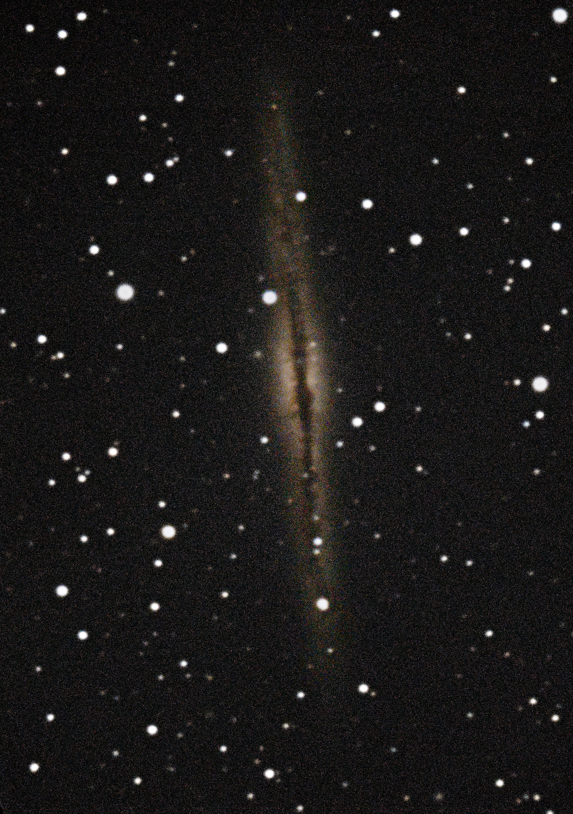

Vi trosset lite lovende værmelding og dro til Skibotn på en helgetur. 

Det var varierende skydekke og ikke fantastiske forhold, men vi fikk satt opp og alignet 14-tommeren, observert masse forskjellige objekter og gjort et første forsøk på å ta bilder med teleskopet:

