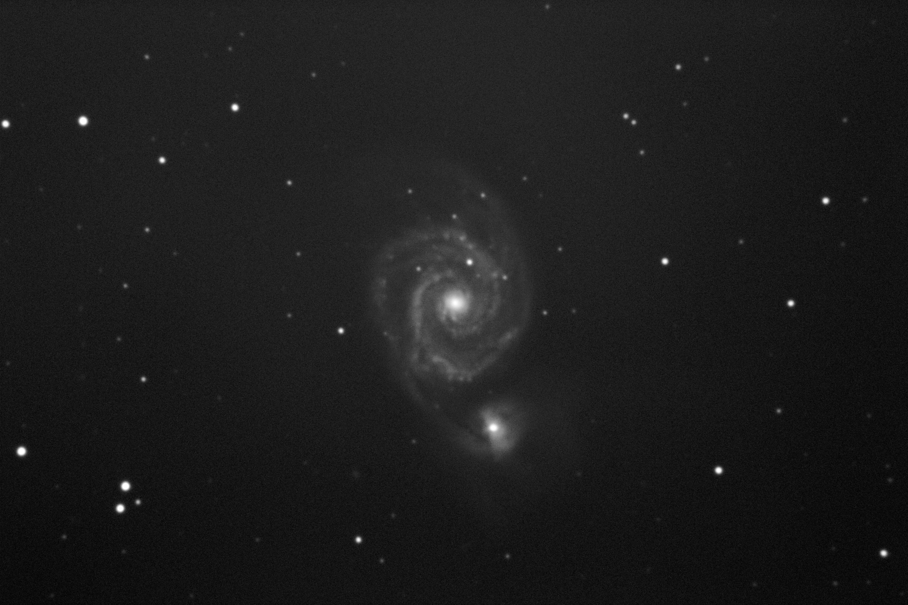
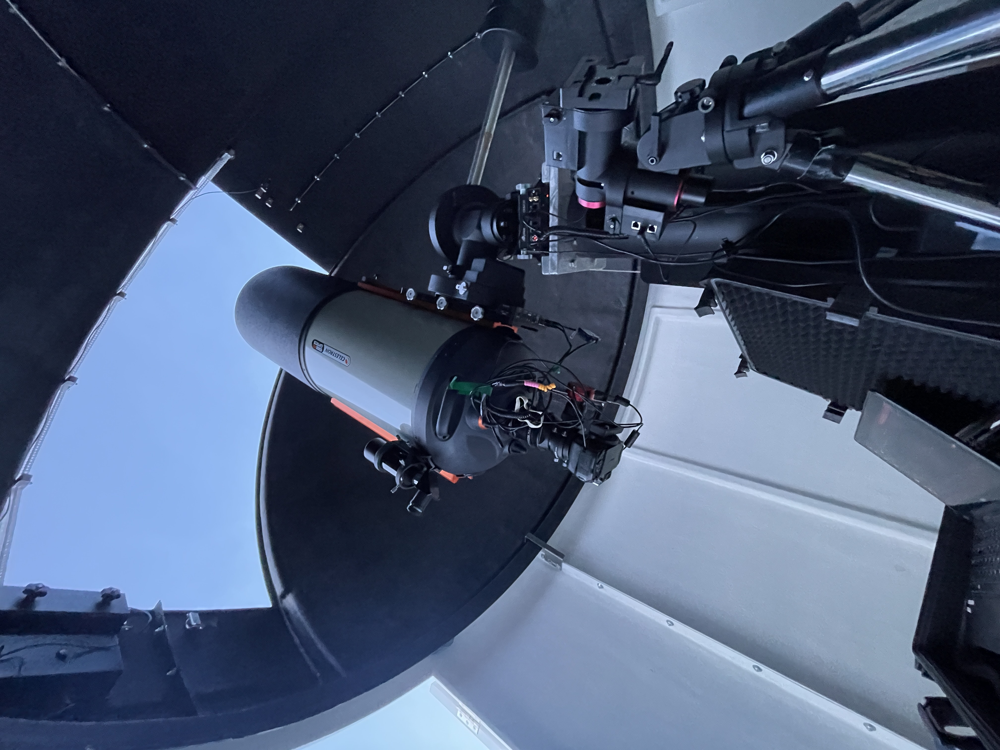

Værvarselet på yr hadde sett dårlig ut i lang tid, men når vi satt på medlemsmøtet på onsdag var det meldt litt delvis skyet oppholdsvær på fredagskvelden. Så tre av oss bestemte oss for å dra inn til Skibotn for å prøve å gjøre noen observasjoner.

Det så ikke lovende ut når vi kjørte fra Tromsø, med til dels kraftig snø/sludd i perioder. Men vi holdt motet oppe og når vi nærmet oss Skibotn kunne vi se enkelte stjerner og planeter fra bilen.

Vi var fremme og i gang rundt klokken sju. Det gikk ganske mye tid til å få satt opp og justert utstyret på både 14 og 20-tommeren, og det ble en del hodebry med nytt utstyr på begge kikkertene. Men været var veldig varierende, så vi hadde det ikke for travelt med å få ting til. Rundt midnatt hadde vi fått testet ut det meste og det ble etterhvert godt klarvær (og mye nordlys). Tok kvelden uten å fått observert noe særlig, men var ganske sikker på at vi god kontroll på utstyret.

Neste dag var det også blitt grei værmelding for natt til søndag vi bestemte oss for å overnatte en gang til, og forhåpentligvis samlet litt mer data. Utover mot midnatt ble det greit med klarvær igjen og vi fikk ganske mange bilder av M82 gjennom både C14 og 20 tommeren. Etterhvert byttet vi også mål til M51 på 20 tommeren og fikk rundt 100 minutter der også. Filene lastes opp [her](https://www.jottacloud.com/s/091c4614f34e28049b0876d0dfda84dcfe7) for for medlemmer som er interessert i å se på/bildebehandle selv. Klokken to stengte vi ned og tok kveld med god samvittighet.

*Foto: Solveig Løvseth. Eksponering: 120s*

Neste dag våknet vi sent, gikk opp til toppen for å rydde (tok litt over to timer) og kjørte hjemmover mot Tromsø i tre-tiden. Alle var enig i at dette hadde vært en fin tur!

*Foto: Geologen*

Dersom du er interessert kan du laste ned rådataene til astrofotografiene [her](https://www.jottacloud.com/s/091c4614f34e28049b0876d0dfda84dcfe7).
